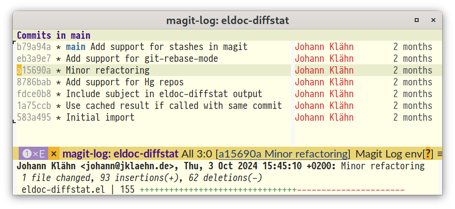

# eldoc-diffstat — Make VCS diffstat available via eldoc

This package provides a way to display VCS diffstat information via eldoc.
It supports Git and Mercurial repositories.



To use, call `eldoc-diffstat-setup` in the desired buffer or mode hook, e.g.:

```elisp
(add-hook 'git-rebase-mode-hook #'eldoc-diffstat-setup)
(add-hook 'log-view-mode-hook #'eldoc-diffstat-setup)
(add-hook 'magit-log-mode-hook #'eldoc-diffstat-setup)
(add-hook 'magit-status-mode-hook #'eldoc-diffstat-setup)
(add-hook 'vc-annotate-mode-hook #'eldoc-diffstat-setup)
```

You might also want to add the following to your config:

```elisp
(eldoc-add-command
 'magit-next-line 'magit-previous-line
 'magit-section-forward 'magit-section-backward
 'magit-section-forward-sibling 'magit-section-backward-sibling)
```

Adapted from Tassilo Horn's 2022 blog post “[Using Eldoc with Magit
(asynchronously!)][tsdh-blog-post]”.

[tsdh-blog-post]: https://www.tsdh.org/posts/2022-07-20-using-eldoc-with-magit-async.html
