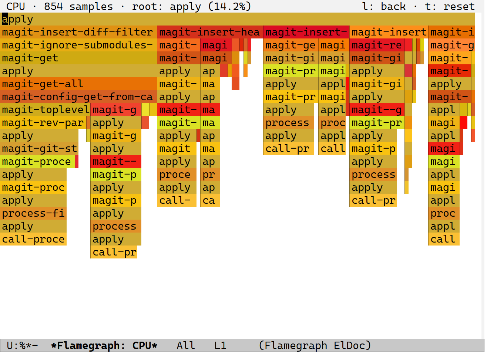
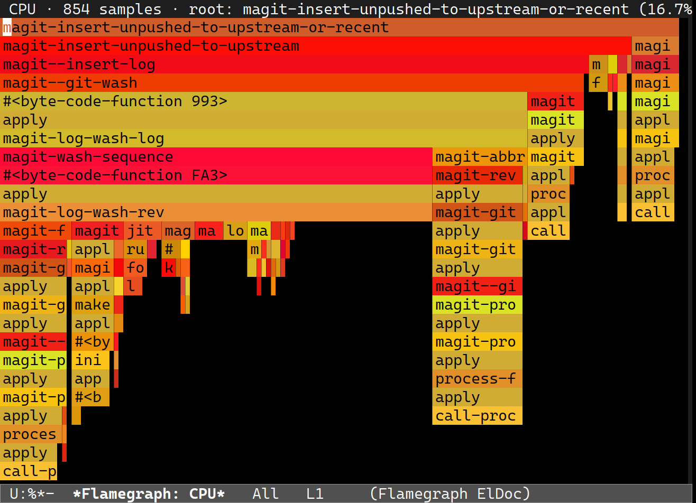
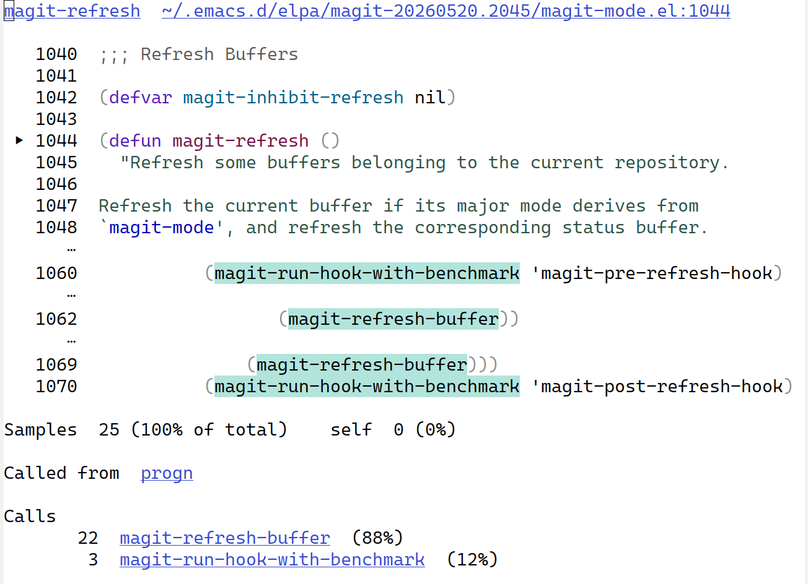
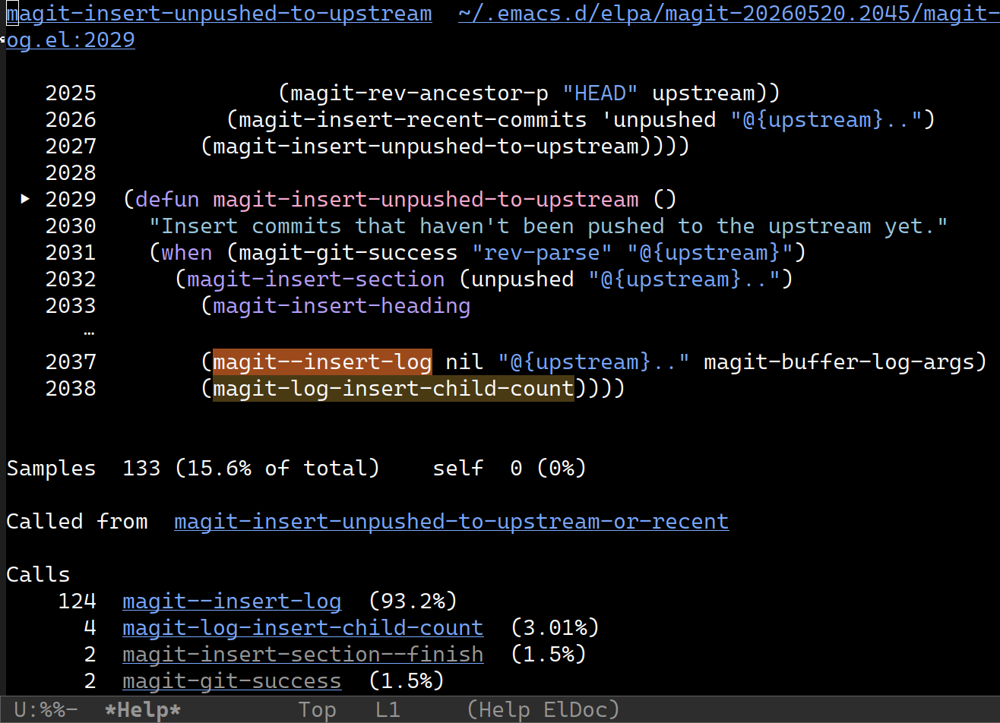

# flamegraph.el

[Flame graphs][bg] for the Emacs profiler, and for folded-stacks
files produced by `perf`, `py-spy`, `rbspy`, etc.

[bg]: https://www.brendangregg.com/flamegraphs.html

Rendered into an interactive buffer using display specs (an SVG
renderer is planned). Top-down "icicle" orientation: the outermost
frame sits on the top row, and the stack grows downward. Identical
call paths are merged and children are sorted heaviest-first.

`RET` / `mouse-1` zooms into a frame; `d` opens a description (parent,
callees, self-time) with a source code snippet highlighting its
outgoing calls; `f` opens that source. The snippet and `f` need the
data to include `file:line` — Elisp profiles always do; for perf,
fold with `-F +srcline` (see [Recording](#recording-profile-data)
below).

<p style="white-space:nowrap">
  
  
</p>
<p style="white-space:nowrap">
  
  
</p>

In the snippet, we pull in and highlight the source lines where the
frame's outgoing calls appear. Parent and callees are cross-references
(click to describe them); `l` / `r` walk the navigation history,
help-mode style.

## Installation

Until this lands on a package archive, clone the repo and add it to
your `load-path`:

```elisp
(add-to-list 'load-path "/path/to/emacs-flamegraph")
(autoload 'flamegraph-profiler-report "flamegraph" nil t)
(autoload 'flamegraph-find-file       "flamegraph" nil t)
```

Requires Emacs 30.1+.

## Quick start

### From a live profile

```
M-x profiler-start RET cpu RET     ; or `cpu+mem'
…run the code you want to measure…
M-x flamegraph-profiler-report
```

### From a saved profile or folded-stacks file

```
M-x flamegraph-find-file RET path/to/profile-or-stacks RET
```

Auto-detects between a profile saved with `profiler-report-write-profile`
and a "folded stacks" file. The latter is a common interchange format
(one `;`-separated stack per line, followed by the sample count).

## Key bindings (in the `*Flamegraph*` buffer)

| Key | Action |
| --- | --- |
| `RET`, `mouse-1` | Zoom into the frame at point (make it the new root) |
| `u` | Zoom out one level |
| `t` | Reset zoom to the full graph |
| `l` / `r` | Go back / forward through the zoom history |
| `n`, `TAB` | Next frame |
| `p`, `S-TAB` | Previous frame |
| `d` | Describe the frame at point (samples, parent, callees, source) |
| `mouse-2` | Describe the clicked frame |
| `f` | Visit the frame's source (definition or executing line) |
| `g` | Redraw (e.g. after resizing the window) |
| `q` | Quit |

## Recording profile data

### Emacs's native profiler

Just `M-x profiler-start` / `M-x flamegraph-profiler-report`. Or save
with `profiler-report-write-profile` and view later with
`flamegraph-find-file`.

### perf (Linux)

Recording:

```sh
perf record -F 99 -g --call-graph fp -p <pid> -- sleep 30
```

Use frame-pointer unwinding (`--call-graph fp`) when possible — DWARF
unwinding (`--call-graph dwarf,N`) caps the captured stack at N bytes
and turns into `[unknown]` frames once Emacs's redisplay/bidi recursion
overflows it. This needs the binary built with `-fno-omit-frame-pointer`.

Folding with source locations:

```sh
perf script --max-stack 512 --no-inline -F +srcline --full-source-path \
            -i out.perf.data \
  | perl stackcollapse-perf.pl --srcline \
  > out.folded
```

Both `-F +srcline` (perf has to be asked to emit srclines) and
`--no-inline` (perf 6.8's `addr2line` subprocess protocol desyncs on
binutils ≥2.39's variable inline-record count) are required. Use
`--full-source-path` so resolved paths are absolute.

If you want to keep inlined frames despite this, you'll need either
perf ≥ 6.9 (`--addr2line`) or an Emacs built `-no-pie` so the script's
own `addr2line -i` can resolve PIE addresses.

### py-spy, rbspy

```sh
py-spy record --format raw -o out.folded …
rbspy record --format flamegraph --raw-file out.folded …
```

Both emit frames in `NAME (file:line)` / `NAME - file:line` shape; the
package parses both.

For more profilers and recording recipes, see section 4 ("Instructions")
of the canonical [CPU Flame Graphs][cpufg] article.

[cpufg]: https://www.brendangregg.com/FlameGraphs/cpuflamegraphs.html

## Customization

| Variable | Purpose |
| --- | --- |
| `flamegraph-width` | Canvas width in columns (default: window width) |
| `flamegraph-frame-border` | Pixel gap between adjacent frame boxes |
| `flamegraph-text-padding` | Pixels between a frame's left edge and its label |
| `flamegraph-source-directory` | Where to resolve relative paths when visiting source |

| Face | Purpose |
| --- | --- |
| `flamegraph-call-site` | Highlight for callee occurrences in the describe-buffer snippet |

## Development

`make check` byte-compiles (warnings → errors) and runs the ERT suite;
`EMACS=/path/to/emacs make check` pins a particular build. CI runs it
on Emacs 30.1 and snapshot.

New ERT tests are welcome; they live under `test/`.

## License

GPL-3.0-or-later.
