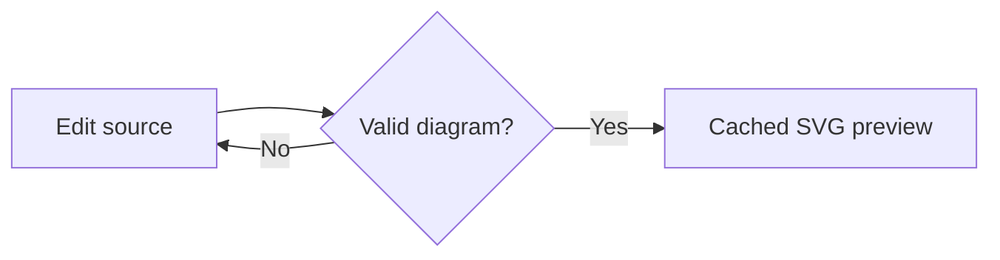
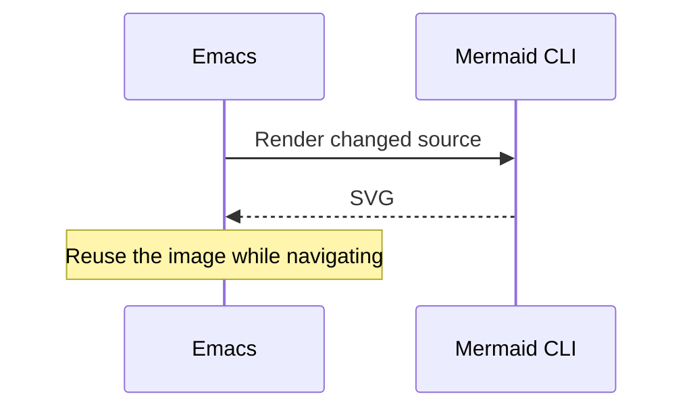

# Mermaid previews

Enable `markdown-ts-appear-enable-mermaid-preview` and restart appear mode.
Enter a diagram to edit its source; leave it to restore the preview.

```mermaid
flowchart LR
    A[Edit source] --> B{Valid diagram?}
    B -->|Yes| C[Cached SVG preview]
    B -->|No| A
```

```mermaid
sequenceDiagram
    participant E as Emacs
    participant M as Mermaid CLI
    E->>M: Render changed source
    M-->>E: SVG
    Note over E: Reuse the image while navigating
```
